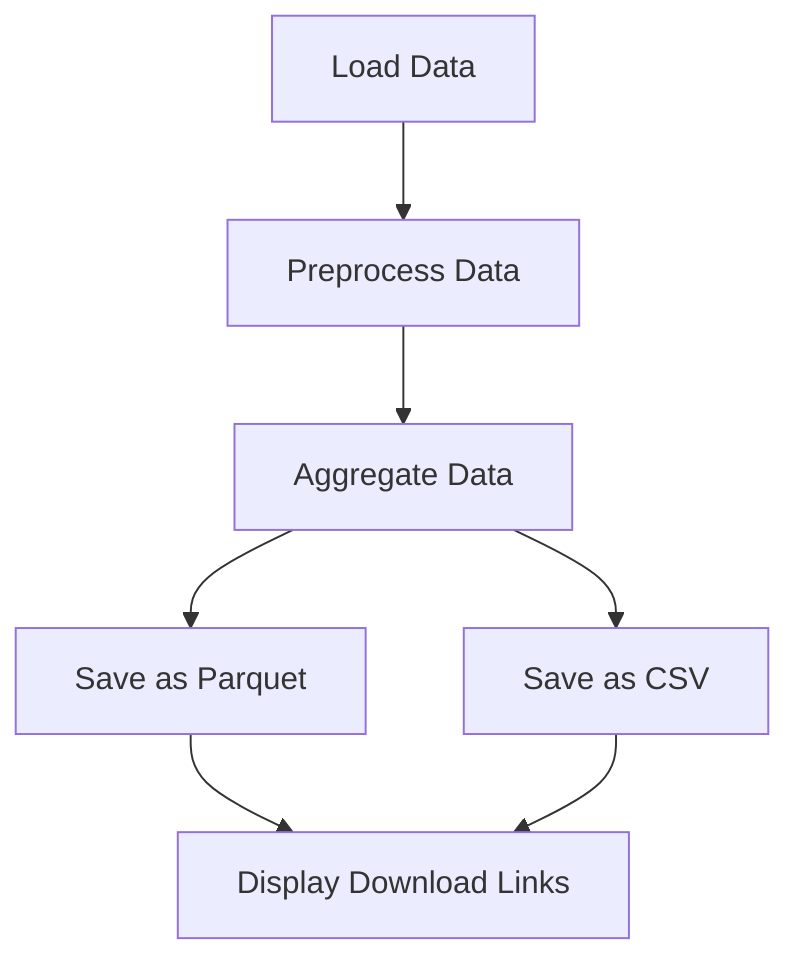
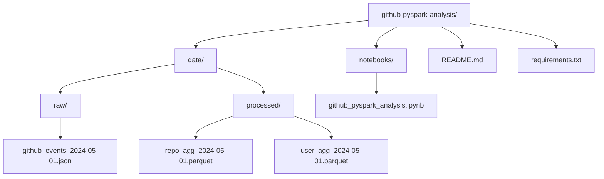

# PySpark Analysis Notebook

This repository contains a Jupyter notebook for performing data analysis using PySpark. The notebook processes GitHub event data, aggregates it, and provides insights into repository and user activities.

## Table of Contents
- [Overview](#overview)
- [Setup](#setup)
- [Notebook Structure](#notebook-structure)
- [Diagrams](#diagrams)


## Overview

The Jupyter notebook included in this repository is designed to:
1. Load and preprocess GitHub event data.
2. Perform aggregation on repository and user activities.
3. Save the processed data into various formats (Parquet, CSV).
4. Display download links for the processed data.

## Setup

To set up this project, follow these steps:

1. **Clone the repository**:
   ```bash
   git clone https://github.com/your-username/github-pyspark-analysis.git
   cd github-pyspark-analysis

2. **Install dependencies:**:
   ```bash
    pip install -r requirements.txt

 

## Notebook Structure

 - Run Cells:

Execute the cells sequentially to preprocess and analyze the data.
The notebook includes detailed comments and explanations for each step.

 - Download Processed Data:

The processed data is saved in various formats and download links are displayed in the notebook.
 -  Notebook Structure
The notebook is structured into the following sections:

### Setup and Initialization:

- Import necessary libraries.
- Initialize Spark session.

### Data Loading:

- Load data from specified paths.

### Data Preprocessing:

- Clean and preprocess the data.

### Aggregation:

- Perform aggregation on repository and user activities.

### Data Export:

- Save processed data into Parquet and CSV formats.
- Generate download links for the saved files.

## Diagrams



## Directory Structure



